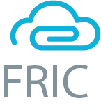

<h1 align="center"> 
   
  </a>
   
  Findings and Reporting Information Console - FRIC
   
  </h1>

  
 
 

## Documentation 📓
Our complete documentation of the FRIC tool can be found [here](https://fric-team-8.gitbook.io/fric/)

## Scope of Product
The Cyber Experimentation & Analysis Division (CEAD) recognizes the complexity and the time it takes to manage task assignments, progress, vulnerability discovery during a cyber engagement and generate custom reports that presents the discovered vulnerabilities and potential issues to CEAD’s target audience. They want a system that would aid the management of task, collection of evidence, and report generation during a cyber engagement.

The University of Texas at El Paso (UTEP) and CEAD are collaborating to develop Findings and Reporting Information Console (FRIC) system that will provide the ability to manage task assignment and progress, and facilitate the collection of evidence on existing vulnerabilities, and generation of custom reports.

This is the FRIC system, as developed by Team 8 (SBSG) of the Fall 2020 CS 4311 cohort at the University of Texas at El Paso. FRIC uses the following technologies for its development.

* PWA/SPA — Single page app
* Built with Vue.js, Buefy & Bulma
* SCSS sources with variables
* Mobile Responsive

## Table of Contents

* [Quick Start](#quick-start)
* [Browser Support](#browser-support)
* [Reporting Issues](#reporting-issues)
* [Licensing](#licensing)
* [Useful Links](#useful-links)

## Quick Start

#### Preliminary Dependencies
FRIC builds off NodeJS and MongoDB. Thus, both of these need to be installed on your machine before you can continue with the installation of FRIC.
- Download and install [NodeJS](https://nodejs.org/en/)
- Download and install [MongoDB](https://docs.mongodb.com/manual/installation/)
> For more detail on the install of Node or Mongo, please view the project documentation

After you have installed both of those dependencies you can proceed with the next steps...

#### Get the repo

Download the source code with `git clone https://github.com/KevinApodaca/FRIC-team8-SBSG.git` 

#### Install

To install all dependencies for the frontend ui: `cd` to project's frontend directory and run `npm install`

To install all dependencies for the backend services: `cd` to project's backend directory and run `npm install`

#### Serve

To pre-compile & hot-reload for development run `npm run serve`in the frontend directory

To start the Express server and the MongoDB instance, run `npm start` in the backend directory

#### Build

Production-ready with minified bundle `npm run build`

## Browser Support

Currently supports 
- Firefox
- Chrome
- Safari
- Brave
- Opera
- Edge
- Min

## Reporting Issues

## Licensing

## Useful Links

- [Vue.js Guide](https://vuejs.org/v2/guide/)
- [Vue CLI Guide](https://cli.vuejs.org/guide/)
- [Buefy](https://buefy.org)
- [Bulma](https://bulma.io)
